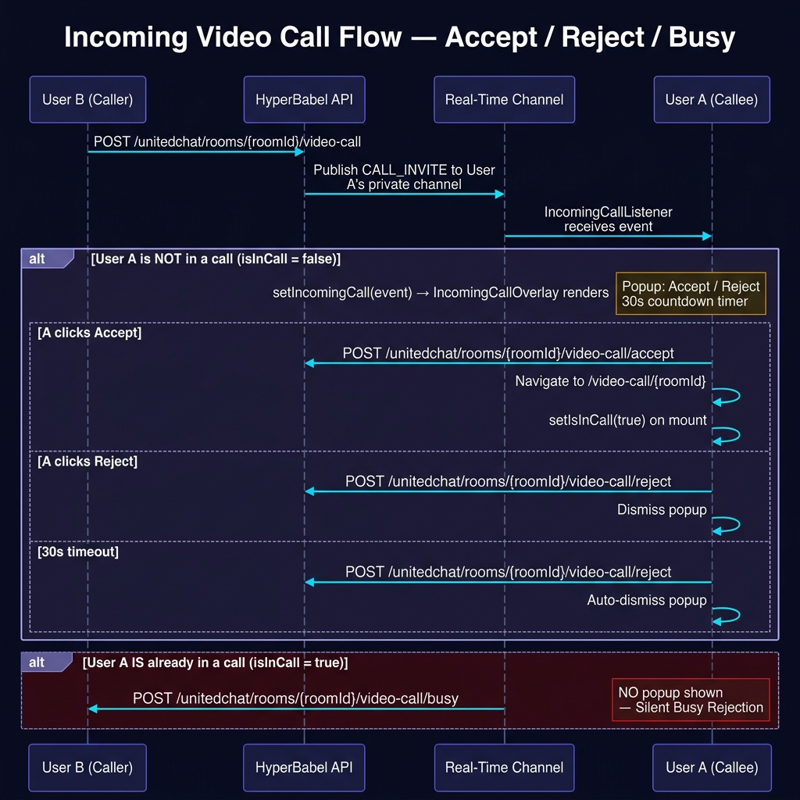

# HyperBabel React Demo Sample

A comprehensive React demo application that showcases all features of the **HyperBabel API Platform**. Use this project as a reference implementation for integrating HyperBabel APIs into your own React applications.

## Features

| Feature | APIs Used |
|---|---|
| **1:1 Chat** | United Chat — Rooms, Messages, Batch-Translate |
| **Group Chat** | United Chat — Rooms, Messages, Members, Sub-Admins, Ban/Unban |
| **Open Chat** | United Chat — Rooms, Join, Leave |
| **1:1 Video Call** | United Chat — Video Call (start, accept, reject, end) |
| **Group Video Call** | United Chat — Video Call (start, accept, leave, end) |
| **Live Stream (Host)** | Stream — Create, Start, End |
| **Live Stream (Viewer)** | Stream — Viewer Token |
| **Auto-Translation** | Translation — Text, Batch, Detect, Languages |
| **In-Call Chat** | United Chat — Messages with auto-translation |
| **Live Stream Chat** | Chat — Channels, Messages with auto-translation |
| **File Upload** | Storage — Presign → Upload → Confirm (3-step) |
| **Typing Indicators** | Chat — Typing endpoint |
| **Reactions** | Chat — Add/Remove Reactions |
| **Message Threads** | Chat — Thread Replies |
| **Full-Text Search** | Chat — Search Messages |
| **Read Receipts** | United Chat — Mark as Read |
| **Pin Messages** | United Chat — Pin/Unpin |
| **Mute/Unmute Rooms** | United Chat — Mute/Unmute |
| **Freeze/Unfreeze** | United Chat — Freeze/Unfreeze |
| **Presence (Online/Offline)** | Presence — Heartbeat, Status, Bulk Query |
| **Push Notifications** | Push — Register/Unregister Token |
| **API Usage Monitoring** | Auth — Usage |
| **Webhook Management** | Auth — Webhooks CRUD, Logs, Regenerate Secret |
| **Language Detection** | Translation — Detect |

## Prerequisites

- **Node.js** v18+ (v20 recommended)
- **HyperBabel API Key** — Get one from the [HyperBabel Console](https://console.hyperbabel.com)

## Quick Start

```bash
# 1. Navigate to the demo project
cd sample_demos/react

# 2. Install dependencies
npm install

# 3. Set up environment variables
cp .env.example .env
# Edit .env with your API key and API base URL

# 4. Start the development server
npm run dev
```

Open [http://localhost:5173](http://localhost:5173) in your browser.

## Environment Configuration

| Variable | Description | Default |
|---|---|---|
| `VITE_HB_API_URL` | HyperBabel API base URL | `https://api.hyperbabel.com/api/v1` |
| `VITE_HB_API_KEY` | Your API Key from the Console dashboard | — |

For local development against the HyperBabel API server, set the URL to your local backend:
```
VITE_HB_API_URL=http://localhost:8080/api/v1
```

### 🔒 CORS & Allowed Origins Security

Starting in Production, HyperBabel APIs enforce **Strict Origin Validation (Zero Trust)** for API Keys.

- **Vite Default Port:** This React demo runs on `http://localhost:5173` by default.
- If you have configured **Allowed Origins** for your API Key via the HyperBabel Console (Dashboard), the API will strictly block any request that does not originate from the exact specified domains.
- **Local Testing:** To run this demo locally using a secured API Key, you **MUST** explicitly add your local development domain (e.g., `http://localhost:5173`) to the Allowed Origins list in your Console Dashboard. Otherwise, you will encounter a `403 Forbidden` error.

## Project Structure

```
react/
├── src/
│   ├── services/                # API service modules
│   │   ├── api.js               # Base HTTP client (fetch wrapper)
│   │   ├── authService.js       # Auth — Usage & Webhooks
│   │   ├── unitedChatService.js # United Chat — Rooms, Messages, Video Call, Ban, Mute, Freeze
│   │   ├── chatService.js       # Chat — Low-level channels, messages, reactions, threads
│   │   ├── videoService.js      # Video — Standalone session management
│   │   ├── streamService.js     # Stream — Live broadcast sessions
│   │   ├── translateService.js  # Translation — Text, Batch, Detect, Languages
│   │   ├── storageService.js    # Storage — 3-step presigned-URL upload
│   │   ├── presenceService.js   # Presence — Heartbeat, Status, Bulk query
│   │   └── pushService.js       # Push — FCM/APNs token management
│   │
│   ├── components/              # Reusable UI components
│   │   ├── Header.jsx           # Navigation header with presence status toggle
│   │   ├── ChatMessageList.jsx  # Scrollable message list with translations
│   │   ├── IncomingCallOverlay.jsx # Incoming call popup (glassmorphism UI)
│   │   └── ChatInput.jsx        # Message input with file attach & typing
│   │
│   ├── context/
│   │   └── CallContext.jsx      # Global video call state (isInCall, incomingCall)
│   │
│   ├── pages/                   # Page-level components
│   │   ├── LoginPage.jsx        # User login
│   │   ├── SignUpPage.jsx       # User registration
│   │   ├── DashboardPage.jsx    # Sandbox Hub — entry point to all features
│   │   ├── ChatHubPage.jsx      # Unified Chat Hub (room list + chat room)
│   │   ├── VideoCallPage.jsx    # Video call with in-call chat
│   │   ├── LiveStreamPage.jsx   # Live stream (host/viewer) with chat
│   │   └── SettingsPage.jsx     # Usage, Webhooks, Push, Language Detection
│   │
│   ├── utils/
│   │   └── ringtone.js          # Incoming call ringtone via Web Audio API
│   │
│   ├── App.jsx                  # React Router configuration
│   ├── main.jsx                 # Application entry point
│   └── index.css                # Global CSS design system (dark theme)
│
├── docs/
│   └── video_call_flow.png      # Incoming call flow sequence diagram
│
├── .env.example                 # Environment variables template
├── index.html                   # HTML entry point
├── package.json                 # Dependencies
└── README.md                    # This file
```

## Incoming Video Call Flow

The diagram below illustrates the full lifecycle of an incoming video call:
accepting, rejecting, 30-second auto-reject timeout, and the busy-rejection
path when the callee is already in another call.



| Scenario | API Call | Result |
|---|---|---|
| **Accept** | `POST /unitedchat/rooms/{roomId}/video-call/accept` | Navigate to VideoCallPage |
| **Reject** | `POST /unitedchat/rooms/{roomId}/video-call/reject` | Dismiss popup |
| **Timeout (30s)** | `POST /unitedchat/rooms/{roomId}/video-call/reject` | Auto-dismiss |
| **Busy (in another call)** | `POST /unitedchat/rooms/{roomId}/video-call/busy` | Silent rejection, no popup |

> The incoming call event arrives via the HyperBabel Real-Time private channel
> (`hb:{orgId}:private:{userId}`) subscribed by `IncomingCallListener.jsx`.
> The global `isInCall` flag (managed by `CallContext.jsx`) determines whether
> the popup is shown or a silent busy-rejection is sent instead.

---

## API Integration Patterns

### 1. Base API Client

All API calls go through `src/services/api.js`, which injects the API key:

```javascript
import api from './services/api';

// GET request with query parameters
const rooms = await api.get('/unitedchat/rooms', { user_id: 'user-001' });

// POST request with JSON body
const room = await api.post('/unitedchat/rooms', {
  room_type: 'group',
  creator_id: 'user-001',
  room_name: 'Team Chat',
  members: ['user-002', 'user-003'],
});
```

### 2. United Chat — Creating Rooms

```javascript
import * as unitedChat from './services/unitedChatService';

// 1:1 DM (returns existing room if already exists)
const dm = await unitedChat.createRoom({
  room_type: '1to1',
  creator_id: 'alice',
  members: ['bob'],
});

// Group chat
const group = await unitedChat.createRoom({
  room_type: 'group',
  creator_id: 'alice',
  room_name: 'Project Alpha',
  members: ['bob', 'charlie'],
});

// Open (public) room
const open = await unitedChat.createRoom({
  room_type: 'open',
  creator_id: 'alice',
  room_name: 'Community Hub',
});
```

### 3. Auto-Translation

Messages are auto-translated using the batch-translate endpoint:

```javascript
// Load messages
const { messages } = await unitedChat.getMessages(roomId, { limit: 50 });

// Batch-translate messages from other users
const otherMsgIds = messages
  .filter(m => m.sender_id !== myUserId)
  .map(m => m.id);

const translated = await unitedChat.batchTranslateMessages(
  roomId, otherMsgIds, 'ko' // Translate to Korean
);
```

### 4. Video Call from Chat Room

```javascript
// Start a video call in the room
const result = await unitedChat.startVideoCall(roomId, myUserId);
// → Broadcasts 'video_call.started' to all room members

// Callee accepts
await unitedChat.acceptVideoCall(roomId, calleeUserId);

// Individual leave (group call)
await unitedChat.leaveVideoCall(roomId, myUserId);

// End call for all
await unitedChat.endVideoCall(roomId, myUserId);
```

### 5. File Upload (3-Step Presign Flow)

```javascript
import * as storage from './services/storageService';

// Convenience method that handles all 3 steps
const metadata = await storage.uploadFile(fileObject, channelId);

// Or manually:
// Step 1: Get presigned URL
const { presigned_url, key } = await storage.presign({
  filename: 'photo.jpg',
  mimeType: 'image/jpeg',
  fileSize: 1024000,
});

// Step 2: Upload directly to storage
await storage.uploadToPresignedUrl(presigned_url, file, 'image/jpeg');

// Step 3: Confirm
const meta = await storage.confirmUpload({ key, originalName: 'photo.jpg' });
```

### 6. Presence Heartbeat

```javascript
import * as presence from './services/presenceService';

// Send heartbeat every 30 seconds to stay online
setInterval(() => {
  presence.heartbeat(myUserId, 'web');
}, 30000);

// Check who's online
const { presence: statuses } = await presence.getPresence(['alice', 'bob']);
```

### 7. Webhooks

```javascript
import * as auth from './services/authService';

// Register an endpoint (save the one-time secret!)
const { secret } = await auth.createWebhook({
  url: 'https://your-server.com/webhooks',
  events: ['video.session.started', 'chat.message.sent'],
});

// List all webhooks
const webhooks = await auth.listWebhooks();

// View delivery logs
const logs = await auth.getWebhookLogs({ page: 1, limit: 20 });
```

## Customization

- **Styling**: Edit `src/index.css` to match your brand. All colors, radii, and shadows are defined as CSS custom properties.
- **API URL**: Change `VITE_HB_API_URL` in `.env` to point to your environment.
- **Languages**: Add more languages to the dropdowns in `LoginPage.jsx` and `DashboardPage.jsx`.
- **Real-time**: This demo uses polling for message updates. For production, integrate HyperBabel's real-time channel subscriptions.

## License

This project is licensed under the MIT License - see the [LICENSE](LICENSE) file for details.

> **Disclaimer**: This code is provided for demonstration purposes only. It is not intended for production environments without proper security and performance reviews.
