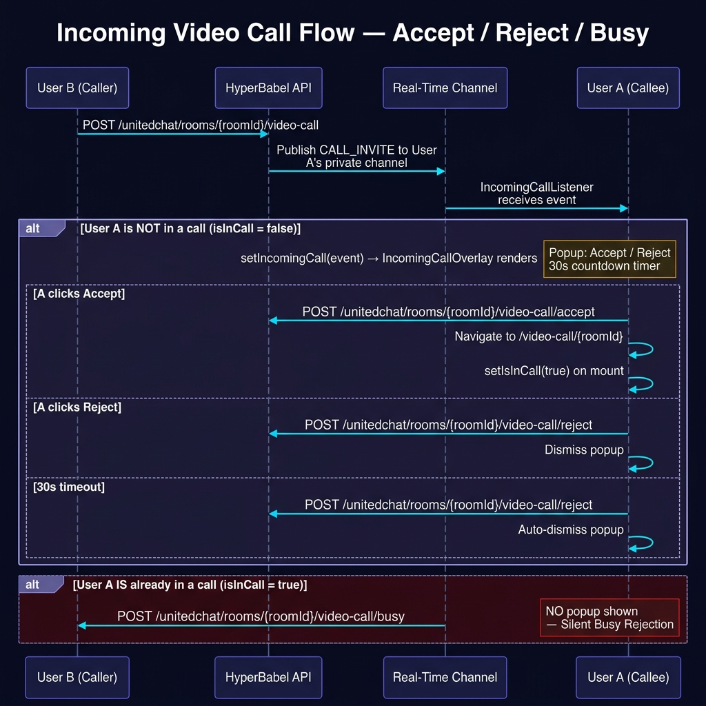

# HyperBabel React Demo Sample

A production-grade React web demo that showcases the HyperBabel API
Platform. Use it as a reference implementation for integrating HyperBabel
into your own React applications.

Authentication uses **Customer Auth pattern B1 — Firebase Direct
Exchange**. The browser signs in with Firebase, exchanges the resulting
ID token for a short-lived HyperBabel customer JWT, and uses that JWT for
every subsequent API call. **The integrator's organization API key
(`hb_live_…` / `hb_test_…`) never ships in the browser bundle.** The HTTP
client throws at startup if it ever sees one.

For the full architecture, see the
[Customer Auth section on the docs site](https://hyperbabel.com/docs#customer-auth).
The per-org Firebase project allow-list is configured in the
[HyperBabel Console](https://console.hyperbabel.com) under **Customer Auth**.

## Features

| Feature | APIs Used |
|---|---|
| **1:1 Chat** | United Chat — Rooms, Messages, Batch-Translate |
| **Group Chat** | United Chat — Rooms, Messages, Members, Sub-Admins, Ban/Unban |
| **Open Chat** | United Chat — Rooms, Join, Leave |
| **1:1 Video Call** | United Chat — Video Call (start, accept, reject, end) |
| **Group Video Call** | United Chat — Video Call (start, accept, leave, end) |
| **Live Stream (Host)** | Stream — Create, Start, End |
| **Live Stream (Viewer)** | Stream — Viewer Token |
| **Auto-Translation** | Translation — Text, Batch, Detect, Languages |
| **In-Call Chat** | United Chat — Messages with auto-translation |
| **In-Call Live Captions** | Speech Translation — `wss /stt-relay` (live STT + translation subtitles), `GET /stt/languages` |
| **Live Stream Chat** | Chat — Channels, Messages with auto-translation |
| **File Upload** | Storage — Presign → Upload → Confirm (3-step) |
| **Typing Indicators** | Chat — Typing endpoint |
| **Reactions** | Chat — Add/Remove Reactions |
| **Message Threads** | Chat — Thread Replies |
| **Full-Text Search** | Chat — Search Messages |
| **Read Receipts** | United Chat — Mark as Read |
| **Pin Messages** | United Chat — Pin/Unpin |
| **Mute/Unmute Rooms** | United Chat — Mute/Unmute |
| **Freeze/Unfreeze** | United Chat — Freeze/Unfreeze |
| **Presence (Online/Offline)** | Presence — Heartbeat, Status, Bulk Query |
| **Push Notifications** | Push — Register/Unregister Token |
| **API Usage Monitoring** | Auth — Usage |
| **Language Detection** | Translation — Detect |

> Webhook CRUD, billing, and other tenant-admin endpoints aren't in the
> demo — they require a console-session JWT (not an API key) and are
> managed in the [HyperBabel Console](https://console.hyperbabel.com).

---

## Quickstart — from zero to running app

1. **Sign up at the HyperBabel Console** —
   <https://console.hyperbabel.com>. Once your organization exists,
   open **Customer Auth → Add Firebase project**.

2. **Allow-list your Firebase project**. In the console wizard:
   - Paste your Firebase project ID (e.g. `your-app-prod`).
   - Paste a Firebase ID token to prove ownership (the wizard shows two
     ways to generate one).
   - Click *Verify and add*. This step tells HyperBabel "trust ID tokens
     from this Firebase project."

3. **Enable sign-in methods in Firebase Console**:
   - Authentication → Sign-in method → enable **Email/Password** (and
     **Anonymous** if you want the kiosk-mode button on the login screen).
   - Authentication → Settings → Authorized domains → ensure your dev
     origin (`localhost` is allow-listed by default) and any prod hostname
     are present. Without this, Firebase rejects sign-in with `auth/unauthorized-domain`.

4. **Copy your Firebase Web SDK config** from Firebase Console → Project
   Settings → Your apps → Web → "Config" snippet. You need
   `apiKey`, `authDomain`, `projectId`, `storageBucket`,
   `messagingSenderId`, `appId`.

5. **Install, configure, and run**:
   ```bash
   cd sample_demos/react
   cp .env.example .env.local
   #  → paste your Firebase Web SDK values into the VITE_FIREBASE_* slots
   npm install
   npm run dev
   ```
   Open <http://localhost:5173> in your browser. The login screen renders
   a sign-in form when Firebase is configured, or a "Firebase config
   missing" hint otherwise.

That's the whole setup. Sign in (or create an account), and the demo
will exchange the Firebase ID token for a customer JWT, store the pair in
`localStorage`, and route you into the main app.

### Browser storage trade-off

The customer JWT lives in `localStorage`, which is XSS-readable. This is
the inherent cost of any client-direct B1 flow. The risk is bounded —
customer JWTs are short-lived (1 h access, 30 d refresh) and scoped to
a single end-user; they cannot create new users or touch billing. For
higher assurance, host an httpOnly-cookie backend that brokers the
exchange (pattern B2 in the [Customer Auth docs](https://hyperbabel.com/docs#customer-auth)).

---

## Environment Variables

| Variable | Required | Description |
|---|---|---|
| `VITE_HB_API_URL` | no | API base URL. Defaults to `https://api.hyperbabel.com/api/v1`. |
| `VITE_FIREBASE_API_KEY` | yes | Firebase Web SDK — apiKey |
| `VITE_FIREBASE_AUTH_DOMAIN` | yes | Firebase Web SDK — authDomain |
| `VITE_FIREBASE_PROJECT_ID` | yes | Firebase Web SDK — projectId |
| `VITE_FIREBASE_STORAGE_BUCKET` | yes | Firebase Web SDK — storageBucket |
| `VITE_FIREBASE_MESSAGING_SENDER_ID` | yes | Firebase Web SDK — messagingSenderId |
| `VITE_FIREBASE_APP_ID` | yes | Firebase Web SDK — appId |
| `VITE_FIREBASE_VAPID_KEY` | no | Generate in Firebase Console → Cloud Messaging → Web Push Certificates. Required only for browser push. |

There is no API-key env var — the demo only accepts customer JWTs minted
via Firebase Direct Exchange. Setting `VITE_HB_API_KEY` to an `hb_live_…`
/ `hb_test_…` value makes the HTTP client throw at startup.

All variables must be prefixed with `VITE_` to be inlined into the Vite
bundle.

### 🔒 CORS & Allowed Origins

HyperBabel APIs enforce **Strict Origin Validation** for org API keys.
That validation does NOT apply to customer JWTs from Firebase Direct
Exchange (the bearer is the per-end-user JWT, not your org key), so this
demo works from any authorized Firebase domain without extra console
configuration.

---

## Project Structure

```
react/
├── src/
│   ├── services/                   # API service modules
│   │   ├── api.js                  # Customer JWT HTTP client (B1)
│   │   ├── firebaseAuthService.js  # Firebase → /customer/auth/firebase-exchange
│   │   ├── firebaseService.js      # FCM web push registration (optional)
│   │   ├── authService.js          # Auth — Usage & Webhooks
│   │   ├── unitedChatService.js    # United Chat — Rooms, Messages, Video Call, Ban, Mute, Freeze
│   │   ├── chatService.js          # Chat — Low-level channels, messages, reactions, threads
│   │   ├── videoService.js         # Video — Standalone session management
│   │   ├── streamService.js        # Stream — Live broadcast sessions
│   │   ├── translateService.js     # Translation — Text, Batch, Detect, Languages
│   │   ├── storageService.js       # Storage — 3-step presigned-URL upload
│   │   ├── realtimeService.js      # Real-Time channel subscriptions
│   │   ├── rtcService.js           # Video / Live Stream engine wrapper
│   │   ├── presenceService.js      # Presence — Heartbeat, Status, Bulk query
│   │   └── pushService.js          # Push — FCM token management
│   │
│   ├── components/                 # Reusable UI components
│   │   ├── Header.jsx              # Navigation header with presence toggle
│   │   ├── ChatMessageList.jsx     # Scrollable message list with translations
│   │   ├── IncomingCallOverlay.jsx # Incoming call popup
│   │   └── ChatInput.jsx           # Message input with file attach & typing
│   │
│   ├── context/
│   │   ├── AuthContext.jsx         # Customer JWT lifecycle (sign-in, refresh, logout)
│   │   └── CallContext.jsx         # Global video call state
│   │
│   ├── pages/                      # Page-level components
│   │   ├── LoginPage.jsx           # Firebase Email/Password sign-in + Anonymous
│   │   ├── SignUpPage.jsx          # Firebase createUser → exchange
│   │   ├── DashboardPage.jsx       # Sandbox Hub
│   │   ├── ChatHubPage.jsx         # Unified Chat Hub
│   │   ├── VideoCallPage.jsx       # Video call with in-call chat
│   │   ├── LiveStreamPage.jsx      # Live stream (host/viewer) with chat
│   │   └── SettingsPage.jsx        # Usage, Webhooks, Push, Language Detection
│   │
│   ├── utils/
│   │   └── ringtone.js             # Incoming call ringtone via Web Audio API
│   │
│   ├── App.jsx                     # React Router + Auth/Call providers
│   ├── main.jsx                    # Application entry point
│   └── index.css                   # Global CSS design system (dark theme)
│
├── docs/
│   └── video_call_flow.png         # Incoming call flow sequence diagram
│
├── .env.example                    # Environment variables template
├── index.html                      # HTML entry point
├── package.json                    # Dependencies (React 19, Vite 5.4)
└── README.md                       # This file
```

---

## Incoming Video Call Flow

The diagram below illustrates the full lifecycle of an incoming video call:
accepting, rejecting, 30-second auto-reject timeout, and the busy-rejection
path when the callee is already in another call.



| Scenario | API Call | Result |
|---|---|---|
| **Accept** | `POST /unitedchat/rooms/{roomId}/video-call/accept` | Navigate to VideoCallPage |
| **Reject** | `POST /unitedchat/rooms/{roomId}/video-call/reject` | Dismiss popup |
| **Timeout (30s)** | `POST /unitedchat/rooms/{roomId}/video-call/reject` | Auto-dismiss |
| **Busy (in another call)** | `POST /unitedchat/rooms/{roomId}/video-call/reject` (with reason) | Silent rejection, no popup |

> The incoming call event arrives via the HyperBabel Real-Time private
> channel (`hb:{orgId}:private:{userId}`) subscribed by
> `IncomingCallListener.jsx`. The global `isInCall` flag (`CallContext.jsx`)
> determines whether the popup is shown or a silent busy-rejection is
> sent instead.

---

## API Integration Patterns

### 1. Base API Client

All API calls go through `src/services/api.js`, which attaches the
customer JWT and refreshes it transparently on 401:

```javascript
import api from './services/api';

// GET with query parameters
const rooms = await api.get('/unitedchat/rooms', { user_id: 'user-001' });

// POST with JSON body
const room = await api.post('/unitedchat/rooms', {
  room_type: 'group',
  creator_id: 'user-001',
  room_name: 'Team Chat',
  members: ['user-002', 'user-003'],
});
```

### 2. United Chat — Creating Rooms

```javascript
import * as unitedChat from './services/unitedChatService';

// 1:1 DM (returns existing room if already exists)
const dm = await unitedChat.createRoom({
  room_type: '1to1',
  creator_id: 'alice',
  members: ['bob'],
});

// Group chat
const group = await unitedChat.createRoom({
  room_type: 'group',
  creator_id: 'alice',
  room_name: 'Project Alpha',
  members: ['bob', 'charlie'],
});

// Open (public) room
const open = await unitedChat.createRoom({
  room_type: 'open',
  creator_id: 'alice',
  room_name: 'Community Hub',
});
```

### 3. Auto-Translation

```javascript
const { messages } = await unitedChat.getMessages(roomId, { limit: 50 });

const otherMsgIds = messages
  .filter((m) => m.sender_id !== myUserId)
  .map((m) => m.id);

const translated = await unitedChat.batchTranslateMessages(
  roomId, otherMsgIds, 'ko', // → Korean
);
```

### 4. Video Call from Chat Room

```javascript
const result = await unitedChat.startVideoCall(roomId, myUserId);
await unitedChat.acceptVideoCall(roomId, calleeUserId);
await unitedChat.leaveVideoCall(roomId, myUserId);
await unitedChat.endVideoCall(roomId, myUserId);
```

### 5. File Upload (3-step presign)

```javascript
import * as storage from './services/storageService';

// Convenience helper that runs all three steps
const metadata = await storage.uploadFile(fileObject, channelId);

// Manual:
const { upload_url, key } = await storage.presign({
  filename: 'photo.jpg',
  mimeType: 'image/jpeg',
  fileSize: 1024000,
});
await storage.uploadToPresignedUrl(upload_url, file, 'image/jpeg');
const { url } = await storage.confirmUpload({ key, originalName: 'photo.jpg' });
```

### 6. Presence Heartbeat

```javascript
import * as presence from './services/presenceService';

setInterval(() => presence.heartbeat(myUserId, 'web'), 30000);
const { presence: statuses } = await presence.getPresence(['alice', 'bob']);
```

---

## Customization

- **Styling**: edit `src/index.css` — all colors, radii, and shadows are
  CSS custom properties.
- **API URL**: change `VITE_HB_API_URL` in `.env.local` to point at a
  private HyperBabel deployment.
- **Languages**: extend the `<select>` options in `LoginPage.jsx` /
  `SignUpPage.jsx`.
- **Real-time**: new messages, typing indicators, edits, deletes, and
  call invitations all arrive via the HyperBabel Real-Time channel
  subscription wired up in `services/realtimeService.js` and
  `components/IncomingCallListener.jsx` — no polling.

---

## License

This project is licensed under the MIT License — see the [LICENSE](LICENSE)
file for details.

> **Disclaimer.** This code is provided for demonstration purposes only.
> It is not intended for production environments without proper security
> and performance reviews.
